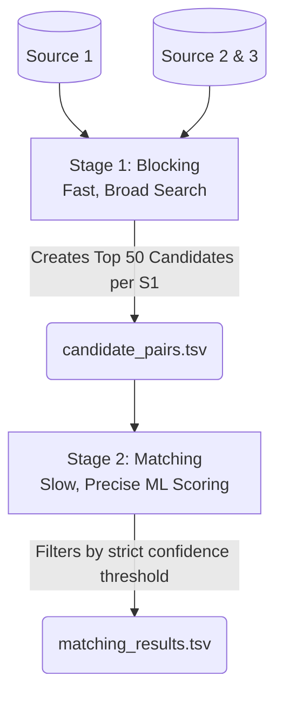

# Deep Dive: Business Entity Resolution Strategy
## A Comprehensive Guide for the Team

This document outlines our complete, end-to-end strategy for solving the Business Entity Resolution challenge. It is written to ensure everyone on the team fully understands *what* we are building, *why* we are building it this way, and *how* it satisfies all competition rules.

---

## Part 1: The Core Problem We Are Solving

Imagine three different spreadsheets containing lists of businesses. Because they come from different vendors, there is no shared "Company ID". Furthermore, human error and different data entry standards mean the same business looks different in each file.

**Examples of Noise We Must Handle:**
| Source 1 (Reference) | Source 2 / Source 3 (Messy) | Why it's hard for a computer |
| :--- | :--- | :--- |
| Apple Inc | Apple Incorporated | Legal suffix differences |
| 123 Main St. | 123 Main Street | Address abbreviations |
| Starbucks | Sturbucks Coffee | Typos & added words |
| 55 5th Ave, NY | Near Central Park, 5th Ave | Missing components & landmarks |

If we use a simple `if name1 == name2` rule in Python, we will fail instantly. We need a smart, machine learning-driven approach.

---

## Part 2: The Two-Stage Architecture (The Solution)

Our Source 1 file has hundreds of thousands of rows. Source 2 and 3 also have hundreds of thousands of rows. If we try to compare every row in Source 1 against every row in Source 2 and 3, we would generate **billions** of comparisons. It would take weeks to run on a standard computer.

Therefore, we must use a **Two-Stage Pipeline**.

### Stage 1: Blocking (Candidate Generation)
**Goal:** Be extremely fast. Filter the billions of possible combinations down to a shortlist of ~50 highly probable candidates for each Source 1 business.
**How it works (TF-IDF & Character N-Grams):**
1. We combine the business name and address into one long string: `starbucks 123 main st`.
2. We chop this string into 3-letter chunks (Character Tri-grams): `sta`, `tar`, `arb`, `rbu`, etc.
3. We do this for all data. We then use a math formula called **Cosine Similarity**. If two businesses share a lot of the same 3-letter chunks, they get a high similarity score.
4. *Why 3-letter chunks?* Because if someone types `MacDonalds` and `McDonalds`, the words are totally different to a computer, but they share almost all of their 3-letter chunks (`cDo`, `Don`, `ona`, `nal`). It is highly resistant to typos!
5. **Output:** We save the top 50 matches for each Source 1 entity into `candidate_pairs.tsv`. This satisfies the first output requirement of the challenge.

### Stage 2: Feature Engineering (The Detective Work)
**Goal:** Now that we only have 50 candidates per business, we can afford to spend computational power looking at them very closely.

For every pair (e.g., S1-Apple vs S2-Apple Inc), we will use fast C++ libraries like `RapidFuzz` to calculate numerical similarity scores:
*   **Levenshtein Distance:** How many keystrokes does it take to turn word A into word B? (e.g., "cat" to "bat" is 1).
*   **Jaro-Winkler:** Similar to Levenshtein, but gives extra points if the two words start with the same first few letters (very useful for company names).
*   **Token Sort Ratio:** If one address is "123 Main St" and the other is "Main St 123", this metric sorts the words alphabetically before comparing them, resulting in a 100% match.
*   **Jaccard Index:** What percentage of words in String A also appear in String B?
*   **Same Country Flag:** Is Country A exactly the same as Country B? (1 for Yes, 0 for No). *Note: We do not hardcode "US" or "India" because we know France is in the test set.*

### Stage 3: The Machine Learning Classifier
**Goal:** Look at the scores from Stage 2 and make a final decision: Match (1) or No Match (0).
*   We will train an **XGBoost** or **LightGBM** model. 
*   We feed it the ground truth data provided in the challenge. It will learn patterns like: *"If Jaro-Winkler is > 0.9 AND they are in the same country AND the Token Sort Ratio is > 0.8, then it is a Match."*
*   These models are incredibly fast, perform brilliantly on this type of tabular data, and are open-source (satisfying the <8 Billion parameter rule).

---

## Part 3: Mastering the Evaluation Metric ($F_{0.5}$)

The most critical part of this challenge is understanding how we are graded. 
We are graded on the **$F_{0.5}$ metric**. 

In machine learning, you always balance **Precision** (When I guess a match, how often am I right?) vs **Recall** (Out of all true matches in the universe, how many did I find?).
The $F_{0.5}$ formula intentionally weights **Precision twice as heavily as Recall**.

**The Business Translation:**
The organizers are telling us: *"Merging two completely different businesses together (False Positive) is a catastrophic error that ruins our database. However, failing to link two businesses that are actually the same (False Negative) is bad, but less destructive."*

**How Our Strategy Adapts to This:**
1.  **Threshold Optimization:** Our XGBoost model will output a probability (e.g., "I am 60% sure this is a match"). In normal ML, anything over 50% is a "Yes". **We will not do this.** We will tune our threshold locally, likely setting it to 80% or 90%. We only declare a match if the model is absolutely certain.
2.  **Handling Singletons:** The challenge explicitly states that correctly identifying a business with *no matches* (a singleton) earns a perfect 1.0 score for that row. Because our threshold is so strict (80%+), if a Source 1 business has no candidates that pass the test, we output an empty list. We don't guess. This guarantees we harvest all the points for singletons without risking false positive penalties.

---

## Part 4: Team Execution Plan

Working with 1.5GB+ of text files is notoriously painful. To ensure the team can collaborate smoothly, we will execute in three phases:

*   **Phase 1: The Micro-Dataset (Day 1)**
    We will write a Python script to sample exactly 10,000 Source 1 IDs and their known matches. We will build the *entire* pipeline (Blocking $\rightarrow$ Features $\rightarrow$ XGBoost) on this tiny dataset. This allows the team to write code, test it, and see results in seconds rather than waiting 30 minutes for a full file to process.
*   **Phase 2: Local Validation (Day 2-3)**
    We will divide the full `train_source1.tsv` into an 80% Training set and a 20% Validation set. We will train on the 80%, predict on the 20%, and calculate our F0.5 score locally. We will tweak our features and our strict threshold until the F0.5 score peaks.
*   **Phase 3: The Final Run (Day 4)**
    We train the model on 100% of the training data. We run inference against the massive Test data. We use the provided `validate_submission.py` script to guarantee our tabs and commas are perfectly formatted, then submit `matching_results.tsv` and `candidate_pairs.tsv`.
